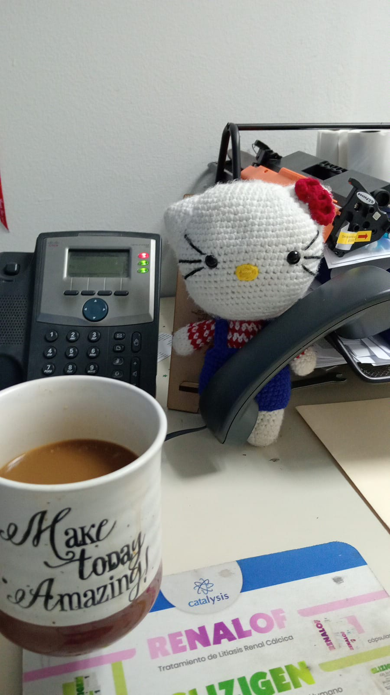
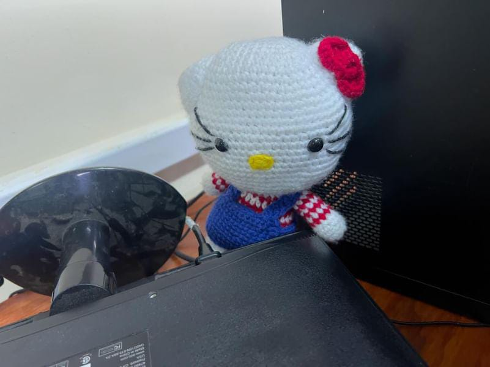
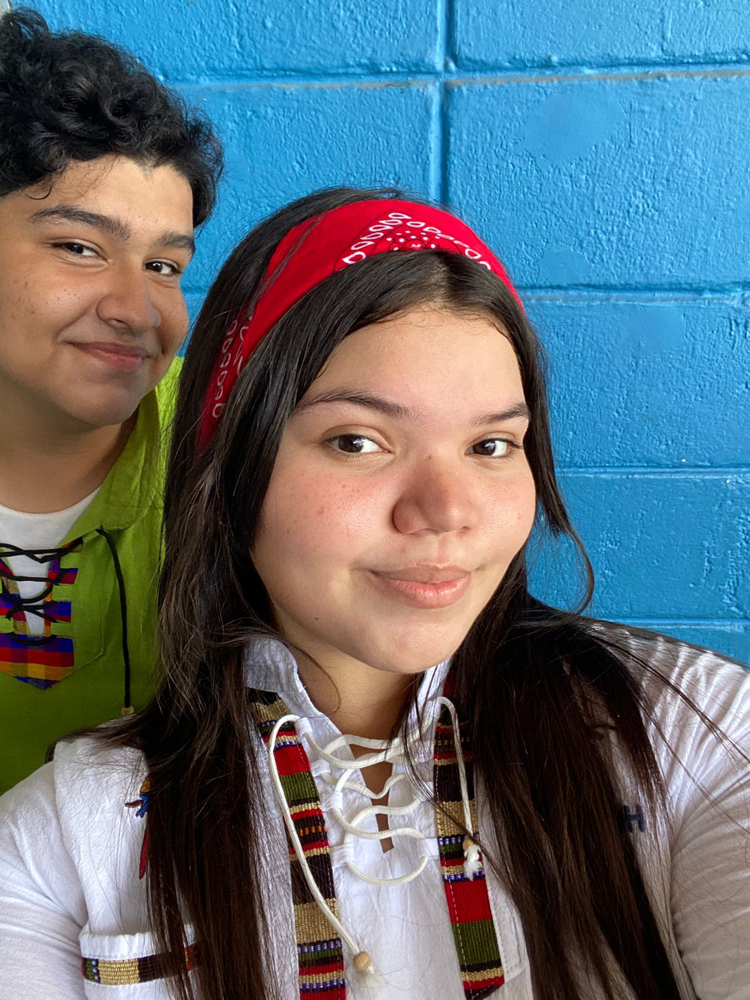
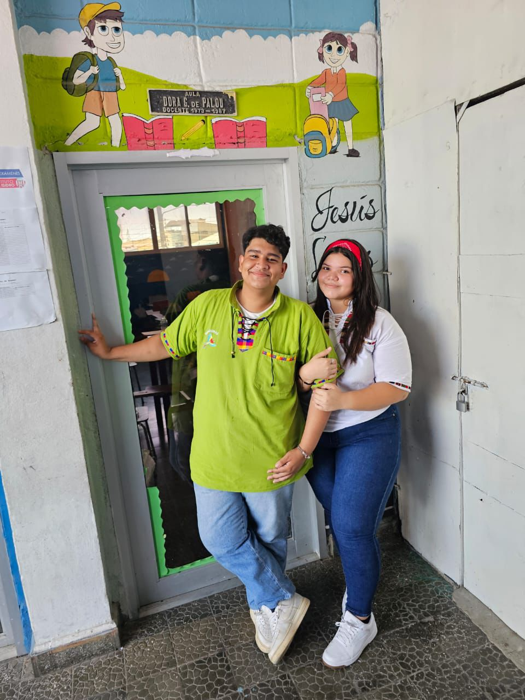
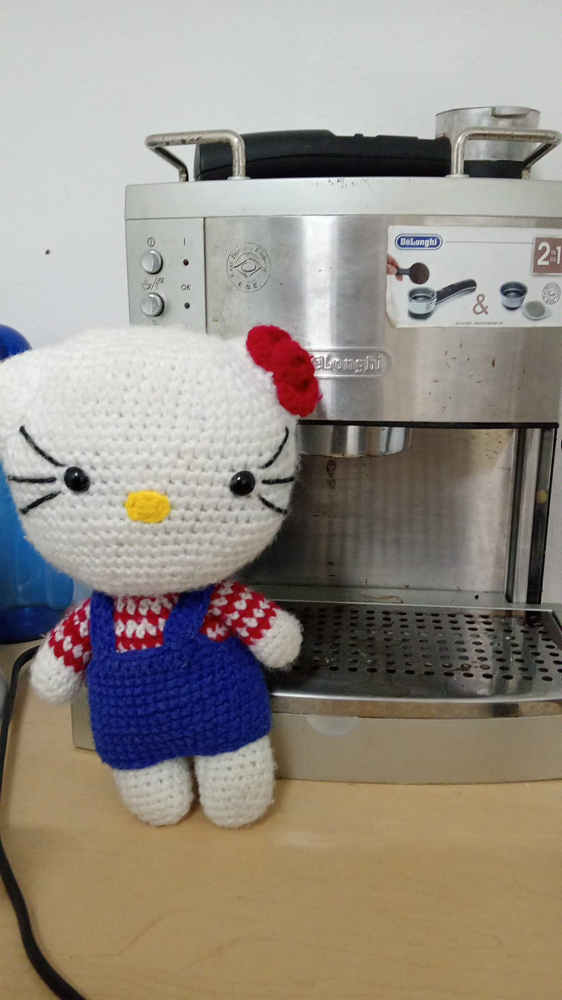

<!DOCTYPE html>
<html lang="es">
<head>
    <meta charset="UTF-8">
    <meta name="viewport" content="width=device-width, initial-scale=1.0">
    
   
</head>
<body>

  <h1>Te amamos mucho mami ❤️</h1>

  

        

            <!-- Aquí agregamos las imágenes sin directorios -->
            
            
            
            
            
            
            
            
            
            
            
            
            <video src="img13.mp4" alt="Costa 13" muted loop></video>
            <video src="img14.mp4" alt="Costa 14" muted loop></video>
            
            
            
            
            
            
            
            
            
            
            
            
            
            
            <video src="img29.mp4" alt="Costa 29" muted loop></video>
        

  

    <!-- Enlaza el archivo JavaScript -->
</body>
</html>

